# Exercise Questions & Answers — Week Week 3 Building a Ride-Hailing REST API with Express.js

## 1. POST Request

### Postman: POST Request
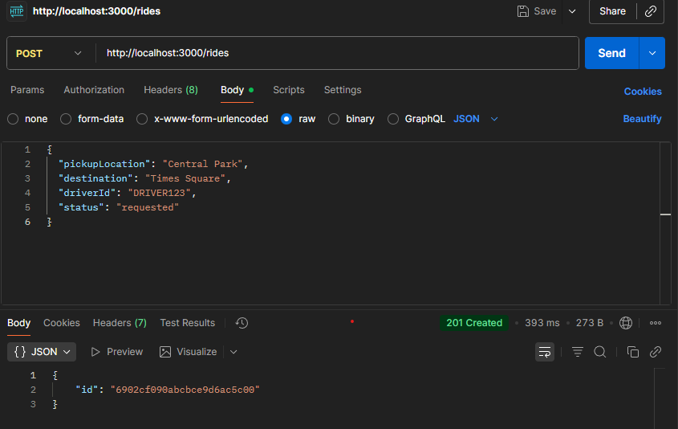


- **HTTP Status Code:** 201 Created  
- **Response Body Example:**
  ```json
  {
    "id": "6902cf09abcbce9d6ac5c00"
  }
  ```

## 2. GET Request

### Postman: Empty GET
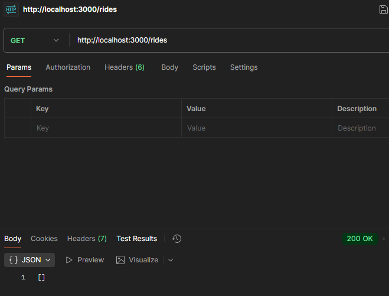

  - **What happens if the rides collection is empty?**: Returns [ ]


### Postman: GET Request
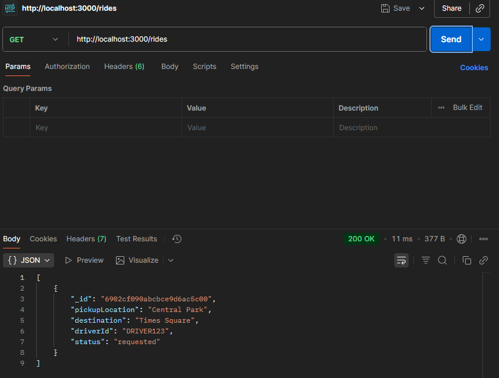

  - **What data type is returned in the response (array/object)?**: Array of objects

## 3. Fix PATCH and DELETE Error:


### Postman: PATCH Request with invalid ID format
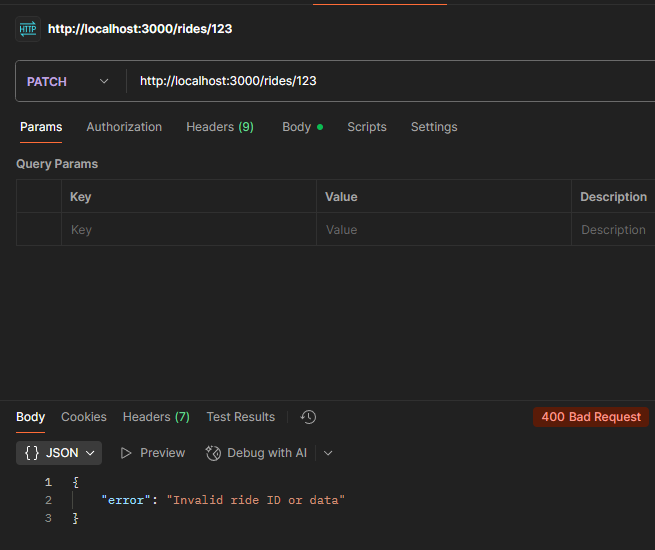
- **Catch the error when requesting PATCH or DELETE API, then try to fix the issue reported.**

#### When I intentionally sent a PATCH or DELETE request with an **invalid ride ID** (e.g., `http://localhost:3000/rides/123`),  
the server threw this error in the console:

```json
{
  "error": "Invalid ride ID or data"
}
```
#### This happens because "123" is not a valid MongoDB ObjectId format.

#### The error was caught using the try { ... } catch (err) { ... } block inside the Express route:

```
catch (err) {
  console.error("PATCH Error:", err.message);
  res.status(400).json({ error: "Invalid ride ID or data" });
}
```

#### Fix: Use a real _id from an existing ride document (copied from GET /rides).

### Postman: PATCH Request with invalid ID
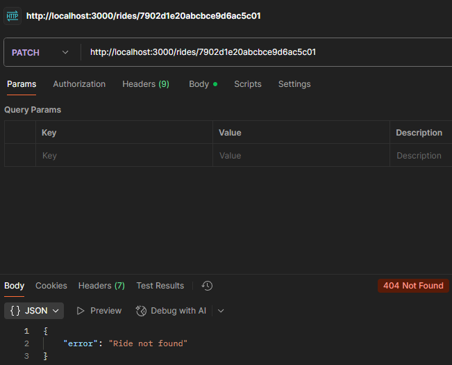


- **If you try to update a non-existent ride ID, what status code is returned?**

#### When I intentionally sent a PATCH request with an **invalid ride ID** (`http://localhost:3000/rides/7902d1e20abcbce9d6ac5c01`), 
the server threw this error in the console:

```json
{
  "error": "Invalid ride ID or data"
}
```

#### Status Code: 404 Not Found

### Postman: Fixed PATCH Request
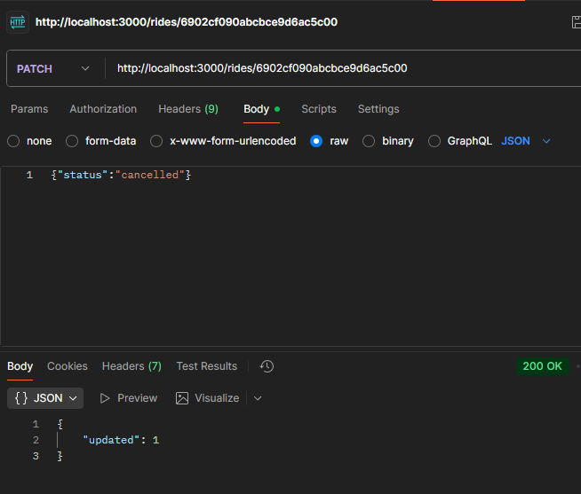

- **What is the value of updated in the response if the update succeeds?**

```json
{
  "updated": 1
}
```

#### Status Code: 200 OK


### Postman: Valid DELETE Request
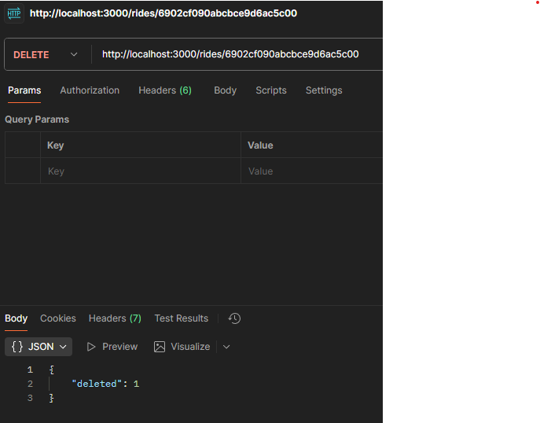
### Postman: Invalid DELETE Request
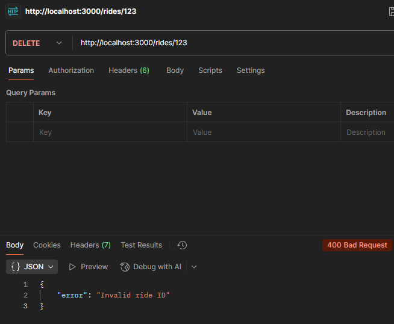
- **How does the API differentiate between a successful deletion and a failed one?**

#### For DELETE, the route checks result.deletedCount to determine what happened.
#### Successful deletion:
```json
{
  "deleted": 1
}
```
#### Shows rider is deleted.

#### Failed deletion:
```json
{
  "error": "Invalid ride ID"
}
```
#### Returns 404 Not Found.

#### Within the code:
```
if (result.deletedCount === 0) {
  return res.status(404).json({ error: "Ride not found" });
}
res.status(200).json({ deleted: result.deletedCount });
```
#### The API differentiates success/failure using the deletedCount property of MongoDB’s result.

## 4. Users Endpoints:
- **Based on the exercise above, create the endpoints to handle the CRUD operations for users account**

#### Added CRUD operations to the code:

```
// CREATE user (POST)
app.post('/users', async (req, res) => {
  try {
    const result = await db.collection('users').insertOne(req.body);
    res.status(201).json({ id: result.insertedId });
  } catch (err) {
    res.status(400).json({ error: "Invalid user data" });
  }
});

// READ all users (GET)
app.get('/users', async (req, res) => {
  try {
    const users = await db.collection('users').find().toArray();
    res.status(200).json(users);
  } catch (err) {
    res.status(500).json({ error: "Failed to fetch users" });
  }
});

// UPDATE user (PATCH)
app.patch('/users/:id', async (req, res) => {
  try {
    const result = await db.collection('users').updateOne(
      { _id: new ObjectId(req.params.id) },
      { $set: req.body }
    );
    if (result.modifiedCount === 0)
      return res.status(404).json({ error: "User not found" });
    res.status(200).json({ updated: result.modifiedCount });
  } catch (err) {
    res.status(400).json({ error: "Invalid user ID or data" });
  }
});

// DELETE user (DELETE)
app.delete('/users/:id', async (req, res) => {
  try {
    const result = await db.collection('users').deleteOne(
      { _id: new ObjectId(req.params.id) }
    );
    if (result.deletedCount === 0)
      return res.status(404).json({ error: "User not found" });
    res.status(200).json({ deleted: result.deletedCount });
  } catch (err) {
    res.status(400).json({ error: "Invalid user ID" });
  }
});
```

### Postman: POST CRUD
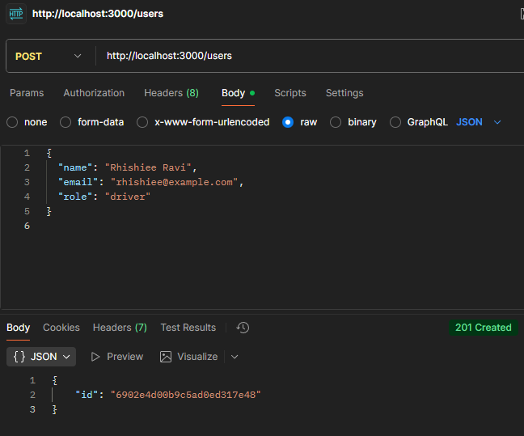

### Postman: GET CRUD
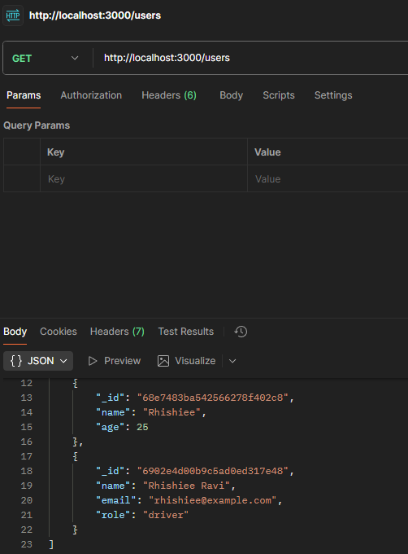

### Postman: POST CRUD
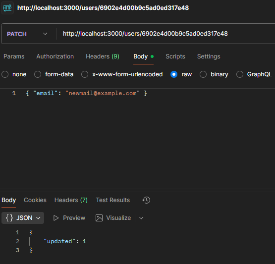

### Postman: DELETE CRUD
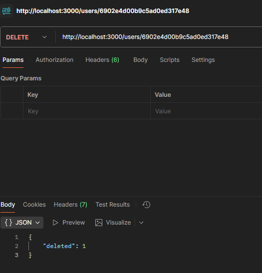

#### Created four new Express routes (/users) to handle CRUD operations for user accounts in MongoDB.
#### Each route connects to the users collection inside testDB.

| Operation  | HTTP Method | Endpoint     | MongoDB Function | Description                           |
| ---------- | ----------- | ------------ | ---------------- | ------------------------------------- |
| **Create** | POST        | `/users`     | `insertOne()`    | Adds a new user document              |
| **Read**   | GET         | `/users`     | `find()`         | Fetches all users from the collection |
| **Update** | PATCH       | `/users/:id` | `updateOne()`    | Modifies an existing user by ID       |
| **Delete** | DELETE      | `/users/:id` | `deleteOne()`    | Removes a user by ID                  |

#### POSTMAN Testing Summary:

| Method | Endpoint     | Example Body                                          | Expected Response        |
| ------ | ------------ | ----------------------------------------------------- | ------------------------ |
| POST   | `/users`     | `{ "name": "Rhishiee", "email": "ravi@example.com" }` | `{ "id": "<ObjectId>" }` |
| GET    | `/users`     | —                                                     | List of all users        |
| PATCH  | `/users/:id` | `{ "email": "newmail@example.com" }`                  | `{ "updated": 1 }`       |
| DELETE | `/users/:id` | —                                                     | `{ "deleted": 1 }`       |

## 5. FrontEnd:
- **Upload the Postman JSON to any AI tools, and generate a simple HTML and JS Dashboard for you**

### Postman: DELETE CRUD
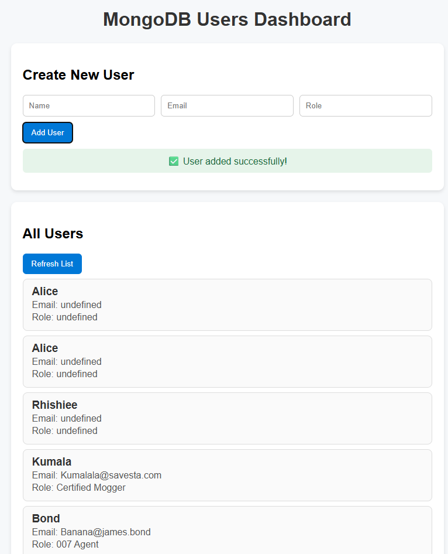

**Steps Done:**
1. Exported the Postman collection file — `My Collection.postman_collection.json`.
2. Uploaded it to an AI tool to auto-generate frontend code.
3. The AI generated a simple HTML + JS dashboard that connects to my Node.js + MongoDB backend.

**Dashboard Features:**
- **Create User** → Sends POST request to `/users`
- **View Users** → Fetches data from GET `/users`
- **Update User** → Sends PATCH request to `/users/:id`
- **Delete User** → Sends DELETE request to `/users/:id`
- Similar CRUD functions can also be done for `/rides`.

#### Result:
- The HTML dashboard connects to the backend successfully.
- CRUD operations can now be performed visually through the browser.