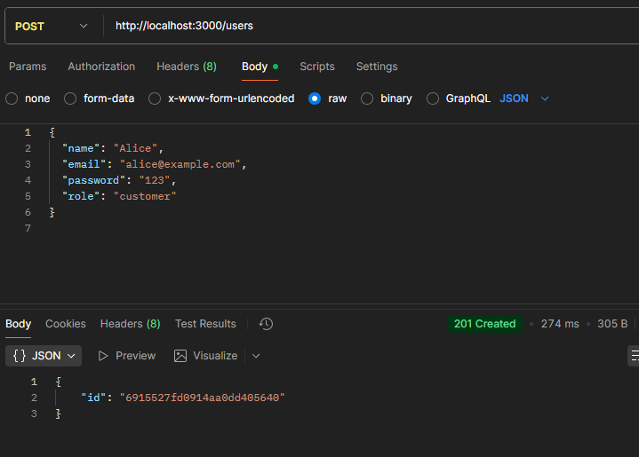
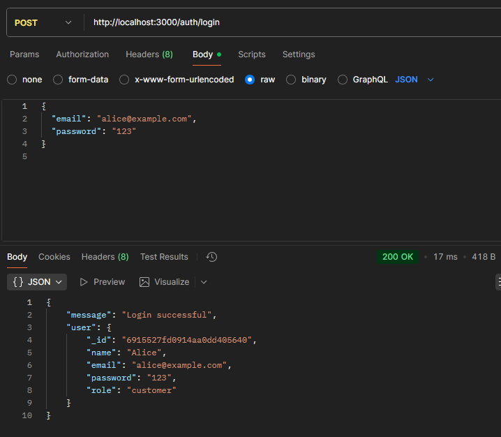
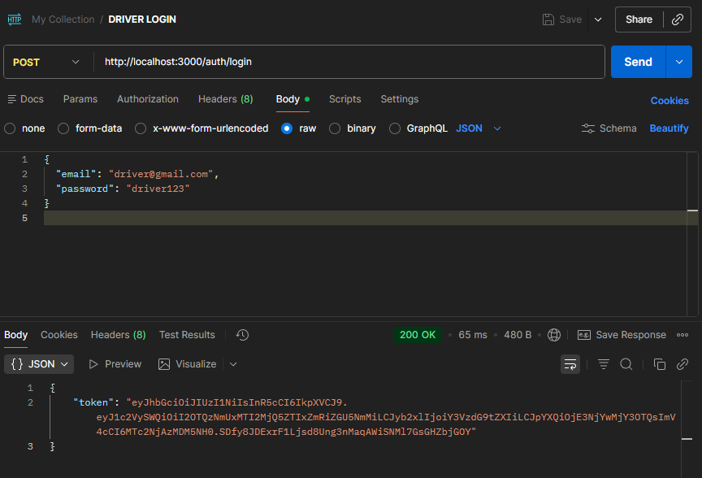
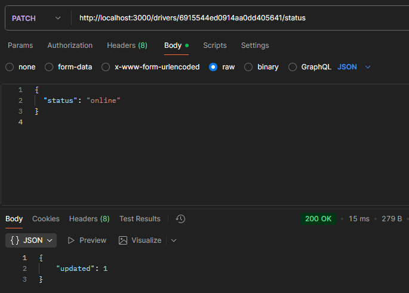
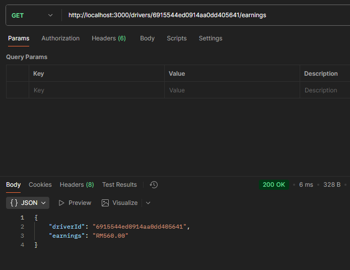
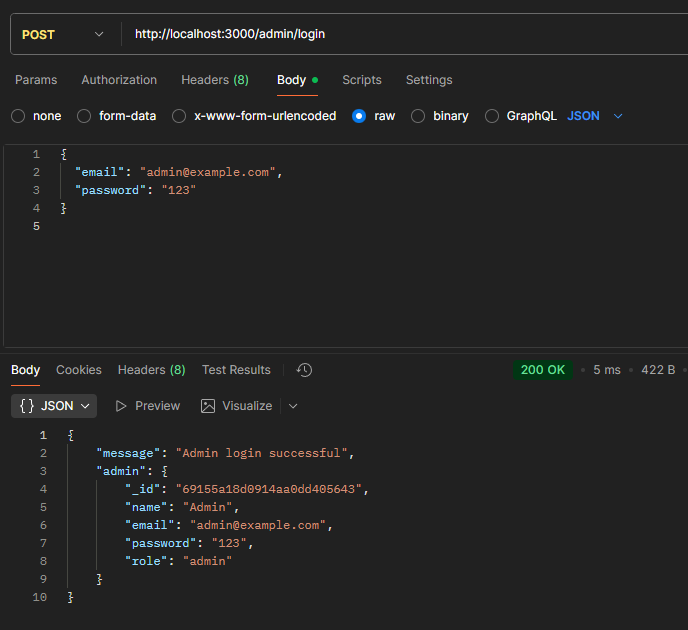

# Exercise Questions & Answers — Week Week 3 Building a Ride-Hailing REST API with Express.js

## Task 1. Brainstorm Actors and Use Cases

#### Actors (Example): Customer, Driver, Admin.
#### Use Cases (Example):
#### - Customer: Register, Login, View Profile, Book Ride, Track Ride
#### - Driver: Login, Update Availability, View Earnings.
#### - Admin: Login, Block User, View System Analytics.

## Task 2. Design the Use Case Diagram

### Use Case Diagram

## Task 3. Define API Specifications

#### Customer APIs
| Use Case              | Endpoint      | Method   | Status Codes                     |
| --------------------- | ------------- | -------- | -------------------------------- |
| Customer Registration | `/users`      | **POST** | **201 Created**, 400 Bad Request |
| Customer Login        | `/auth/login` | **POST** | **200 OK**, 401 Unauthorized     |
| View Profile          | `/users/{id}` | **GET**  | **200 OK**, 404 Not Found        |
| Book Ride             | `/rides`      | **POST** | **201 Created**, 400 Bad Request |
| Track Ride            | `/rides/{id}` | **GET**  | **200 OK**, 404 Not Found        |

#### Driver APIs
| Use Case            | Endpoint                 | Method    | Status Codes                 |
| ------------------- | ------------------------ | --------- | ---------------------------- |
| Driver Login        | `/driver/login`          | **POST**  | **200 OK**, 401 Unauthorized |
| Update Availability | `/drivers/{id}/status`   | **PATCH** | **200 OK**, 404 Not Found    |
| View Earnings       | `/drivers/{id}/earnings` | **GET**   | **200 OK**, 404 Not Found    |

#### Admin APIs
| Use Case              | Endpoint            | Method     | Status Codes                      |
| --------------------- | ------------------- | ---------- | --------------------------------- |
| Admin Login           | `/admin/login`      | **POST**   | **200 OK**, 401 Unauthorized      |
| Block User            | `/admin/users/{id}` | **DELETE** | **204 No Content**, 403 Forbidden |
| View System Analytics | `/admin/analytics`  | **GET**    | **200 OK**, 403 Forbidden         |

## Task 4. Screenshots

#### 1. Customer Registration

#### 2. Customer Login

#### 3. Driver Registration

#### 4. Driver Login

#### 5. Book Ride 

#### 6. Track Ride

#### 7. Driver Update Availability

#### 8. View Driver Earnings

#### 9. Admin Login

#### 10. Admin Block User

#### 11. Admin Analytics 

